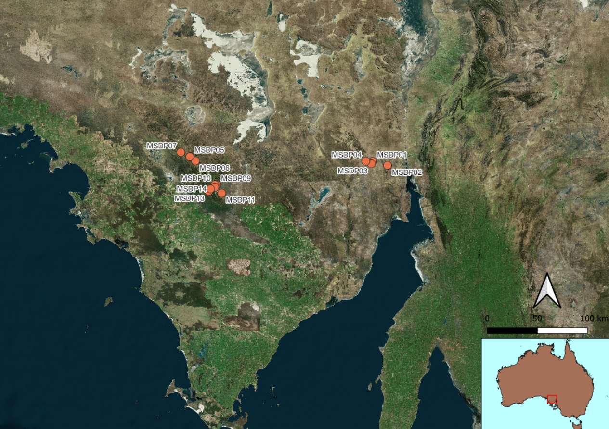

# GSSA-Chem-Lith_Classification

This repository contains the code required to follow the 'Datarock Applied Machine Learning in Geosciences' course and accompanying presentation.  

the notebook 'code/GSSA-chem-lith-model.ipynb' demonstrates concepts covered in the course notes including:

Data Preparation,
Solving Imbalanced Class problems,
Spatial Validation approach and,
Model Explainability.  

The Data, which can be accessed in 'data/' is a filtered version of open-file XRF Chemistry data provided by the Geological Survey of South Australia (GSSA).  It comprises > 1000 rows of XRF chemistry data and lithology labels from 14 drill holes throughout the Gawler Ranges of South Australia (see below).

To set up the environment run the command conda env create -f environment.yml.  Or use pip to install the required libraries.  

 